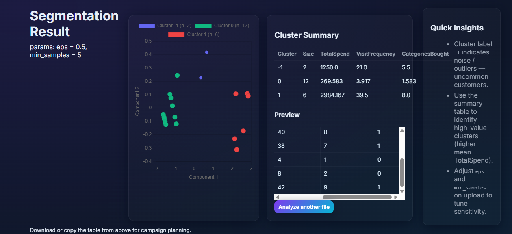

# Customer Segmentation using DBSCAN and Flask

## Overview

This project is a web application that performs customer segmentation using the DBSCAN clustering algorithm.
It allows users to upload a CSV file containing customer purchase history, then automatically groups customers into natural clusters without requiring a predefined number of segments.

## Features

Upload CSV file with customer purchase data

Automatic DBSCAN clustering

Visual representation of clusters

Summary statistics for each segment

Responsive and modern user interface

## Tech Stack

Backend: Python, Flask

Machine Learning: scikit-learn (DBSCAN), pandas, numpy

Visualization: Matplotlib / Chart.js

Frontend: HTML, CSS, Bootstrap

## Installation

1. Clone the Repository

git clone https://github.com/your-username/customer-segmentation-dbscan.git
cd customer-segmentation-dbscan

2. Create Virtual Environment

python -m venv venv

3. Activate the environment:

Windows
venv\Scripts\activate

Linux/Mac
source venv/bin/activate

3. Install Dependencies

pip install -r requirements.txt

4. Run the Flask application:

python app.py

5. Open your browser and navigate to:

http://127.0.0.1:5000

6. Upload your CSV file in the format:

CustomerID	TotalSpend	VisitFrequency	CategoriesBought
C001	1200	20	5
C002	90	2	1
C003	450	6	3

5. View cluster visualization and customer segment insights.

Sample Data
A sample dataset is included in this repository as sample_customers.csv.
You can use it to test the application before uploading your own data.

## Project Structure

## INPUT

## UPLOAD FILE

## OUTPUT

## AUTHOR
R.DHARANI SRI
